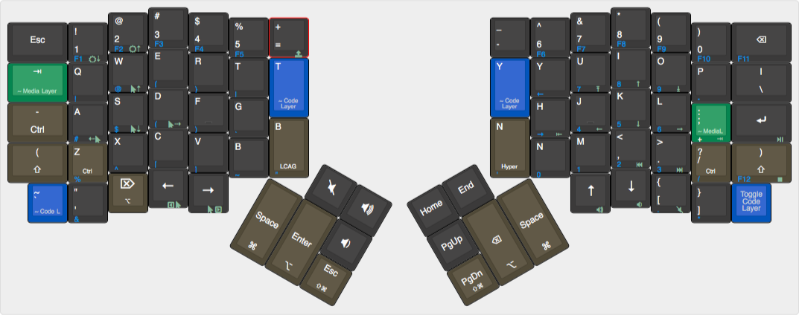

# The OSX Friendly Firmware by Doug Marcey

Based on the default OSX layout, I made a number of tweaks. The main goal is to get the ergonomic benefits of having the ergodox
but also make it easier to switch back to "normal keyboards" (like using my laptop). I stuck with the locations of the printed keys
on my ergodox-ez, but made a number of tweaks to make it easier to use a command line and such. Here is an (hopefully complete)
list of changes.

1. Esc, Tab, Enter, Rshift, Backspace, and Space are closer to where they are on a normal QWERTY keyboard
2. Space Cadet Shift. Left shift generates a ( and right a ) when tapped. Still shift when held
3. Ctrl is on left where is should be for anyone that uses it often. Tapping it will give you a -, useful for command line args.
4. Tab will give you the media layer when held, so there is a media key on both sides
5. Central keys designed to give easy access to mods (GUI, ALT) and Space is on both sides
6. Hyper is there but swapped, instead of MEH there is an LCAG(Ctrl-Alt-GUI), I use this for globals because it's easier to hit on 
    my laptop keyboard for globals.
7. Enter, Esc, Backspace, Volume Control, and PgDn/PgUp/Home/End are in the center with Space
8. GUI+Shift in the center rather than ALT+Shift
9. Moved = and - keys up
10. Added T, Y, B, and N to center tall keys as taps since I still tend to overshoot those, and this makes life less hard
11. Lots of ways to shift to code layer, one toggle 
12. Code layer has full numpad with enter key, and a few more symbols added. 
13. Media layer has added arrow keys (JKIL), a teensy key, mac brightness keys, and shift mouse keys to ASWD

